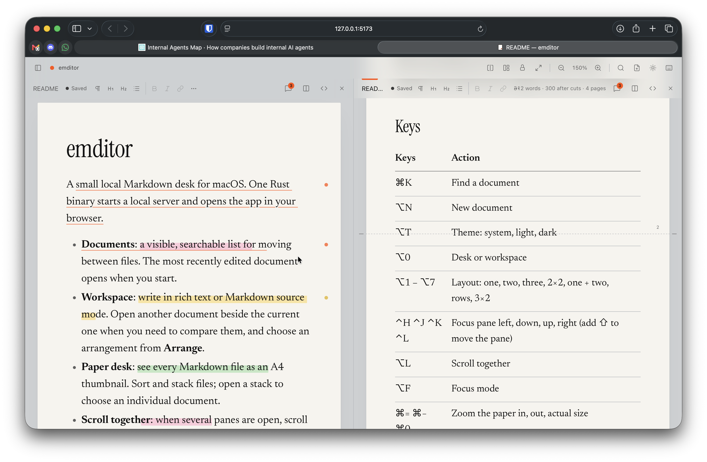

# emditor

A small local Markdown desk for macOS. One Rust binary starts a local server and opens the app in your browser.



- **Documents**: a visible, searchable list for moving between files. The most recently edited document opens when you start.
- **Workspace**: write in rich text or Markdown source mode. Open another document beside the current one when you need to compare them, and choose an arrangement from **Arrange**.
- **Paper desk**: see every Markdown file as an A4 thumbnail. Sort and stack files; open a stack to choose an individual document.
- **Scroll together**: when several panes are open, scroll them by the same distance.
- **Notes**: add a note to selected text, highlight it in one of four colors, or suggest a cut. Notes show in the margin; the pane header shows the word count before and after cuts. Notes stay out of the Markdown file, in `.emditor/notes/<path>.json` next to your documents. A note whose text is gone goes to the shelf under the sheet, where you can attach it to other text.
- **Format bar**: paragraph, headings, lists, bold, italic, links, notes, highlights, and cuts in each pane header. In a narrow pane, the tools that do not fit go into a menu.
- Rich mode can only make what Markdown can store (CommonMark + GFM tables, task lists, strikethrough).
- Autosave, a local draft kept until a save succeeds, conflict recovery when a file changes on disk, and print to real A4 pages.

Use **New document** to create a file. **Find** (⌘K) searches filenames and document contents, including unsaved drafts. A content result opens at its matching line in source mode. Switching panes or editing modes keeps the same draft. If a save fails or a file changes on disk, the pane shows actions to retry, keep your draft, or load the disk version.

## Use

```sh
make build                 # builds web/dist, then target/release/emditor
cd ~/notes && emditor      # serve this folder
emditor draft.md           # open one file (its folder is served)
emditor --port 5000 --no-open
```

The server listens on 127.0.0.1 only and refuses requests from other hosts, origins, and cross-site pages.

## Keys

| Keys | Action |
| --- | --- |
| ⌘K | Find a document or phrase |
| ⌥N | New document |
| ⌥T | Theme: system, light, dark |
| ⌥0 | Desk or workspace |
| ⌥1 – ⌥7 | Layout: one, two, three, 2×2, one + two, rows, 3×2 |
| ⌃H ⌃J ⌃K ⌃L | Focus pane left, down, up, right (add ⇧ to move the pane) |
| ⌥L | Scroll together |
| ⌥F | Focus mode |
| ⌘= ⌘− ⌘0 | Zoom the paper in, out, actual size |
| ⌘/ | Rich text or Markdown source |
| ⌥⌘M | Add a note to the selected text |
| ⌥⌘1 – ⌥⌘4 | Highlight: yellow, green, blue, pink |
| ⌥⌘⌫ | Suggest cutting the selected text |
| ⌥M | Show or hide notes |
| ⌘P | Print the focused pane on A4 |
| ⌥W | Close pane |
| ⌘S | Save all now |
| ⌥/ or ? | All shortcuts |

On the desk: arrows move, ↵ opens (⇧↵ in a new pane), space or ⌘-click selects, G stacks, U unstacks, ⌥+arrows reorder, S changes the sort, + and − change the thumbnail size, N makes a new document.

## Develop

```sh
cd web && npm ci                 # first setup
cd .. && npm run dev             # Rust API and Vite; edit the current folder
npm run dev -- ~/notes           # or edit another folder
make test
```

Open http://127.0.0.1:5173/. Press Ctrl+C to stop both servers.
